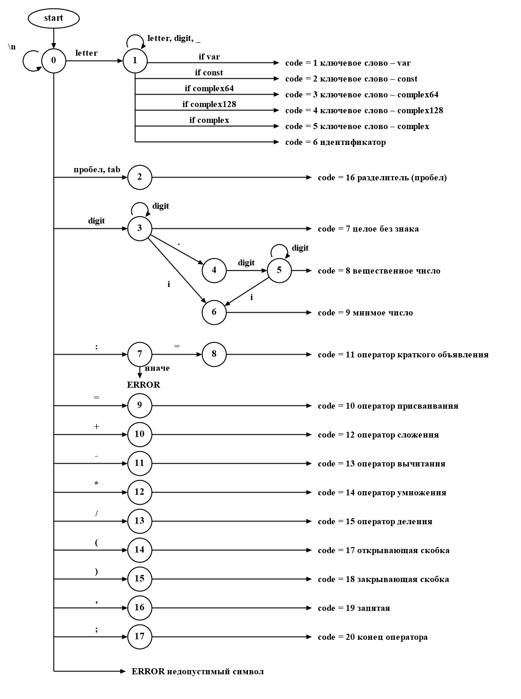

# Лексический анализатор — лабораторная работа №2

Дисциплина «Теория формальных языков и компиляторов».

## Цель работы
Разобраться, как работает лексический анализатор (сканер) и какое место он занимает в компиляторе. Спроектировать конечный автомат для своего варианта, написать по нему сканер и встроить его в редактор из лабораторной работы №1.

## Автор
+ Лузянин З.
+ Группа АП-326

## Постановка задачи
Сканер получает на вход текст из поля редактирования и разбивает его на лексемы. Для каждой лексемы определяется тип и условный код. Символы, которые не могут входить ни в одну допустимую лексему, считаются ошибкой, и для них указывается позиция. Текст может быть многострочным.

Сканер запускается кнопкой «Пуск» (или меню «Пуск», клавиша F5). Результат выводится в таблицу с колонками:
+ Условный код — число, обозначающее тип лексемы (для ошибки — ERROR);
+ Тип лексемы — текстовое описание;
+ Лексема — найденная подстрока;
+ Местоположение — номер строки, начальная и конечная позиция.

Щелчок по строке таблицы ставит курсор в редакторе на эту лексему. Для ошибки курсор встаёт на недопустимый символ.

## Вариант задания
**Вариант:** Объявление комплексного числа в языке Go.

Примеры корректных строк:
```go
var z complex128 = complex(3, 4);
const c complex64 = 2.5 - 1.5i;
w := complex(0.5, 2) * 3i;
```

Допустимые лексемы:

| Код | Тип лексемы | Лексемы |
|---|---|---|
| 1 | целое без знака | `3`, `128` |
| 2 | идентификатор | буква или `_`, дальше буквы, цифры, `_` (`z`, `num_1`) |
| 3 | вещественное число | `2.5`, `0.75` |
| 4 | мнимое число | `4i`, `1.5i` |
| 5 | оператор сложения | `+` |
| 6 | оператор вычитания | `-` |
| 7 | оператор умножения | `*` |
| 8 | оператор деления | `/` |
| 9 | оператор краткого объявления | `:=` |
| 10 | оператор присваивания | `=` |
| 11 | разделитель (пробел) | пробел, табуляция |
| 12 | открывающая скобка | `(` |
| 13 | закрывающая скобка | `)` |
| 14 | ключевое слово | `var`, `const`, `complex64`, `complex128`, `complex` |
| 15 | запятая | `,` |
| 16 | конец оператора | `;` |
| ERROR | недопустимый символ | любой другой символ |

Буквы — только латинские. Перевод строки лексемой не считается: он лишь увеличивает номер строки.

## Диаграмма состояний



Как работает автомат. Разбор каждой лексемы начинается в состоянии 0, выбор ветки зависит от первого символа:
+ **буква** — состояние 1, в котором накапливаются буквы, цифры и `_`. Готовое слово сравнивается со списком ключевых слов: при совпадении это ключевое слово (код 14), иначе идентификатор (код 2);
+ **цифра** — состояние 3, накапливаются цифры. Если дальше идёт точка и после неё цифра, автомат переходит в состояния 4 и 5 и читает дробную часть: получается вещественное число (код 3). Буква `i` сразу после числа переводит в состояние 6: мнимое число (код 4). Иначе это целое без знака (код 1);
+ **двоеточие** — состояние 7. Только вместе с `=` оно даёт оператор `:=` (код 9), одиночное `:` — ошибка;
+ **пробел, табуляция, `=`, `+`, `-`, `*`, `/`, скобки, запятая, `;`** — каждый символ сразу даёт свою лексему (состояния 2, 9–17);
+ **перевод строки** — номер строки увеличивается, автомат остаётся в состоянии 0;
+ **любой другой символ** — ERROR «недопустимый символ».

После каждой лексемы автомат возвращается в состояние 0 и разбирает текст дальше. Поэтому одна ошибка не останавливает анализ: будут найдены все недопустимые символы.

## Реализация
Сканер вынесен в отдельный класс `Scanner` (файл `LangProcessor/Scanner.cs`), интерфейса он не касается. Метод `Analyze(text)` получает текст и возвращает список лексем `Token` со всеми атрибутами: код, тип, текст лексемы, строка, начальная и конечная позиция. Форма только выводит этот список в таблицу.

Состояния автомата перечислены в `ScannerState`, их номера совпадают с диаграммой: `Start` (0), `Word` (1), `Integer` (3), `Dot` (4), `Fraction` (5), `Imaginary` (6), `Colon` (7). Односимвольные лексемы (состояния 2 и 9–17) распознаются сразу из состояния 0. При переходе через `\n` номер строки увеличивается, а отсчёт позиции начинается заново.

Кнопка «Пуск» на панели и пункт меню «Пуск» вызывают один и тот же метод. Перед выводом новых результатов таблица очищается.

## Автоматические тесты
В решении есть проект `LangProcessor.Tests` (xUnit, 30 тестов). Тесты идут по этапам: числа, идентификаторы, ключевые слова, операторы, пробелы и разделители, недопустимые символы, многострочный текст, повторный запуск анализа. Запуск:
```
dotnet test
```

## Тестовые примеры

### Пример 1. Корректная строка
```go
var z complex128 = complex(3, 4);
```

| Условный код | Тип лексемы | Лексема | Местоположение |
|---|---|---|---|
| 14 | ключевое слово | var | строка 1, 1-3 |
| 11 | разделитель (пробел) | (пробел) | строка 1, 4-4 |
| 2 | идентификатор | z | строка 1, 5-5 |
| 11 | разделитель (пробел) | (пробел) | строка 1, 6-6 |
| 14 | ключевое слово | complex128 | строка 1, 7-16 |
| 11 | разделитель (пробел) | (пробел) | строка 1, 17-17 |
| 10 | оператор присваивания | = | строка 1, 18-18 |
| 11 | разделитель (пробел) | (пробел) | строка 1, 19-19 |
| 14 | ключевое слово | complex | строка 1, 20-26 |
| 12 | открывающая скобка | ( | строка 1, 27-27 |
| 1 | целое без знака | 3 | строка 1, 28-28 |
| 15 | запятая | , | строка 1, 29-29 |
| 11 | разделитель (пробел) | (пробел) | строка 1, 30-30 |
| 1 | целое без знака | 4 | строка 1, 31-31 |
| 13 | закрывающая скобка | ) | строка 1, 32-32 |
| 16 | конец оператора | ; | строка 1, 33-33 |


### Пример 2. Строка с недопустимым символом
```go
var z complex64 = 1 @ 2i;
```

| Условный код | Тип лексемы | Лексема | Местоположение |
|---|---|---|---|
| 14 | ключевое слово | var | строка 1, 1-3 |
| 11 | разделитель (пробел) | (пробел) | строка 1, 4-4 |
| 2 | идентификатор | z | строка 1, 5-5 |
| 11 | разделитель (пробел) | (пробел) | строка 1, 6-6 |
| 14 | ключевое слово | complex64 | строка 1, 7-15 |
| 11 | разделитель (пробел) | (пробел) | строка 1, 16-16 |
| 10 | оператор присваивания | = | строка 1, 17-17 |
| 11 | разделитель (пробел) | (пробел) | строка 1, 18-18 |
| 1 | целое без знака | 1 | строка 1, 19-19 |
| 11 | разделитель (пробел) | (пробел) | строка 1, 20-20 |
| ERROR | недопустимый символ | @ | строка 1, 21-21 |
| 11 | разделитель (пробел) | (пробел) | строка 1, 22-22 |
| 4 | мнимое число | 2i | строка 1, 23-24 |
| 16 | конец оператора | ; | строка 1, 25-25 |


### Пример 3. Многострочный текст
```go
var a complex128 = complex(1.5, 2);
const b complex64 = 3i;
c := a + b;
```

| Условный код | Тип лексемы | Лексема | Местоположение |
|---|---|---|---|
| 14 | ключевое слово | var | строка 1, 1-3 |
| 11 | разделитель (пробел) | (пробел) | строка 1, 4-4 |
| 2 | идентификатор | a | строка 1, 5-5 |
| 11 | разделитель (пробел) | (пробел) | строка 1, 6-6 |
| 14 | ключевое слово | complex128 | строка 1, 7-16 |
| 11 | разделитель (пробел) | (пробел) | строка 1, 17-17 |
| 10 | оператор присваивания | = | строка 1, 18-18 |
| 11 | разделитель (пробел) | (пробел) | строка 1, 19-19 |
| 14 | ключевое слово | complex | строка 1, 20-26 |
| 12 | открывающая скобка | ( | строка 1, 27-27 |
| 3 | вещественное число | 1.5 | строка 1, 28-30 |
| 15 | запятая | , | строка 1, 31-31 |
| 11 | разделитель (пробел) | (пробел) | строка 1, 32-32 |
| 1 | целое без знака | 2 | строка 1, 33-33 |
| 13 | закрывающая скобка | ) | строка 1, 34-34 |
| 16 | конец оператора | ; | строка 1, 35-35 |
| 14 | ключевое слово | const | строка 2, 1-5 |
| 11 | разделитель (пробел) | (пробел) | строка 2, 6-6 |
| 2 | идентификатор | b | строка 2, 7-7 |
| 11 | разделитель (пробел) | (пробел) | строка 2, 8-8 |
| 14 | ключевое слово | complex64 | строка 2, 9-17 |
| 11 | разделитель (пробел) | (пробел) | строка 2, 18-18 |
| 10 | оператор присваивания | = | строка 2, 19-19 |
| 11 | разделитель (пробел) | (пробел) | строка 2, 20-20 |
| 4 | мнимое число | 3i | строка 2, 21-22 |
| 16 | конец оператора | ; | строка 2, 23-23 |
| 2 | идентификатор | c | строка 3, 1-1 |
| 11 | разделитель (пробел) | (пробел) | строка 3, 2-2 |
| 9 | оператор краткого объявления | := | строка 3, 3-4 |
| 11 | разделитель (пробел) | (пробел) | строка 3, 5-5 |
| 2 | идентификатор | a | строка 3, 6-6 |
| 11 | разделитель (пробел) | (пробел) | строка 3, 7-7 |
| 5 | оператор сложения | + | строка 3, 8-8 |
| 11 | разделитель (пробел) | (пробел) | строка 3, 9-9 |
| 2 | идентификатор | b | строка 3, 10-10 |
| 16 | конец оператора | ; | строка 3, 11-11 |


Файлы с этими примерами лежат в папке `examples`.

## Сборка и запуск
Готовая программа: `publish/win-x64/LangProcessor.exe`. Это один файл, .NET внутри него уже есть, ничего устанавливать не нужно.

Из исходников (нужен .NET SDK 7.0 или новее): открыть `LangProcessor.sln` в Visual Studio и нажать F5, или
```
cd LangProcessor
dotnet build
dotnet run
```

## Используемые технологии
+ Язык: C#
+ Интерфейс: Windows Forms
+ Платформа: .NET 7
+ Среда разработки: Visual Studio 2022
